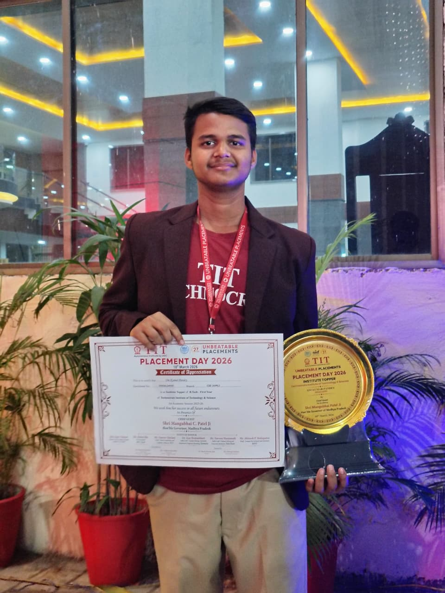
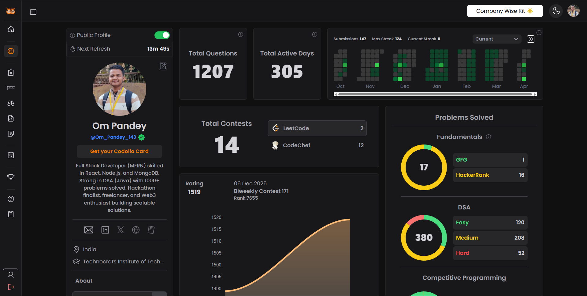
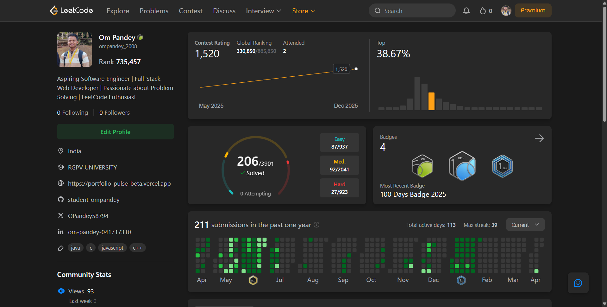

<!--
  📌 SETUP: Create an `assets/` folder in your GitHub repo root and upload:
    • assets/institute_topper.jpeg   ← your award photo
    • assets/codolio_stats.png       ← Codolio dashboard screenshot
    • assets/leetcode_stats.png      ← LeetCode profile screenshot
-->

<table border="0" cellspacing="0" cellpadding="12">
  <tr>
    <td align="center" valign="top" width="33%">
      
        
      
    </td>
    <td align="center" valign="top" width="33%">
      
        
      
    </td>
    <td align="center" valign="top" width="33%">
      
        
      
    </td>
  </tr>
</table>

 

 

---

## 🎯 About Me

I'm a passionate **Full Stack MERN Developer** and **Institute Topper** from **India 🇮🇳**, dedicated to building robust, scalable, and user-centric web applications. I specialize in the complete **MERN Stack** and thrive on turning complex problems into elegant digital solutions. Beyond code, I'm a tech entrepreneur, community builder, and educator — co-founding startups, leading developer communities of 650+, and organizing national-level hackathons.

> *"Turning complex problems into elegant digital solutions — one commit at a time."*

---

## 🏅 Achievements

<b>🎓 Academic Excellence</b>

 

🏆 **Institute Topper — Placement Day 2026**
- Awarded the **Institute Topper** title at Placement Day 2026 by **Technocrats Institute of Technology & Science, Bhopal**
- Certificate of Appreciation presented in presence of **Hon'ble Governor of M.P., Shri Mangubhai C. Patel Ji**
- Recognized as the top-performing student of **CSE (AIML), B.Tech First Year**, Academic Session 2025–26

<b>🌐 National Level Competitions</b>

 

🔴 **Google Big Code — Qualifier + Round 1 Cleared**
- ✅ Cleared the **Qualifier Round** — Ranked in the **Top 15,000 in India**
- ✅ Cleared **Round 1** — Confirmed seat among the **Top 1,500 candidates** nationally
- A testament to strong algorithmic thinking and competitive programming depth

<b>💻 Competitive Programming</b>

 

| Platform | Highlights |
|---|---|
| 🟡 **LeetCode** | **206+ Problems** Solved · Top **38.67% Globally** · **100 Days Badge 2025** · Contest Rating **1,520** |
| 🟢 **CodeChef** | ⭐⭐ **2-Star Programmer** · 12 Contests Participated |
| 🔵 **HackerRank** | ⭐⭐⭐⭐ **4-Star Coder** |
| 📊 **Overall** | **1,000+ DSA Problems** Solved Across Platforms · **305 Active Coding Days** |

<b>🚀 Hackathons & Events</b>

 

| Event | Role | Outcome |
|---|---|---|
| **Hack Days in Bhopal 2.0 (MLH)** | 🏆 Winner | **1st Place** · Powered by Google Gemini · Built AI-powered project (SecondBrain) |
| **Technocrats Innovation Challenge 2K26** | 🎯 Organizer & Lead | National-Level Hackathon · **Top 50 Teams Pan-India** participated |
| **Multiple Hackathons** | Participant / Finalist | **2× Hackathon Finalist** · Strong real-world project experience |
| **Web3 & Blockchain Hackathons** | Explorer | Actively building in decentralized tech and innovation |

<b>👥 Leadership & Community Building</b>

 

**🏢 Co-Founder & Tech Lead — Vexite Studio**
- Co-founded a tech studio delivering scalable and innovative web solutions
- Leading product development, technical architecture, and client delivery

**🌐 Team Lead & Developer — Knowvy Technologies**
- Leading a **650+ member multi-college developer community**
- Mentoring student developers, organizing workshops and technical events
- Promoting ethical open-source collaboration and real-world project development
- Building an inclusive ecosystem for innovation and peer learning

<b>🎥 Creator, Mentor & Freelancer</b>

 

- 🎥 **Tech Content Creator** — Sharing coding knowledge, dev insights, and learning resources
- 📚 **Mentor & Educator** — Passionate about teaching and helping others grow in tech
- 💼 **Freelancer** — Delivering efficient, scalable web solutions for clients
- 🌐 **Web3 Enthusiast** — Exploring blockchain, DeFi, and decentralized innovation
- 🌟 Continuously learning new technologies and building impactful applications

---

## 🔮 Tech Stack

### ⚡ Core — MERN Stack

 

### 🎨 Frontend

 

### 🛠️ Backend & Databases

 

### ⚙️ Languages, Tools & DevOps

---

## 🚀 Current Focus

| Area | Description |
|---|---|
| 🔥 **Production MERN Apps** | High-performance, scalable full-stack web applications |
| 🧠 **System Design** | Architecting resilient and efficient software systems |
| 🌐 **Web3 & Blockchain** | Decentralized apps and DeFi exploration |
| 🌟 **Open Source** | Contributing to the global developer community |
| 📚 **Teaching & Mentoring** | Building the next generation of developers |

---

## 📊 GitHub Stats

 

 

---

## 🌐 Let's Connect & Collaborate

&nbsp;

&nbsp;

  

**Open to:** Full Stack Roles &nbsp;·&nbsp; Freelance Projects &nbsp;·&nbsp; Open Source &nbsp;·&nbsp; Web3 Hackathons &nbsp;·&nbsp; Mentorship

 

 

**⭐ Star my repos if you find them useful!**

